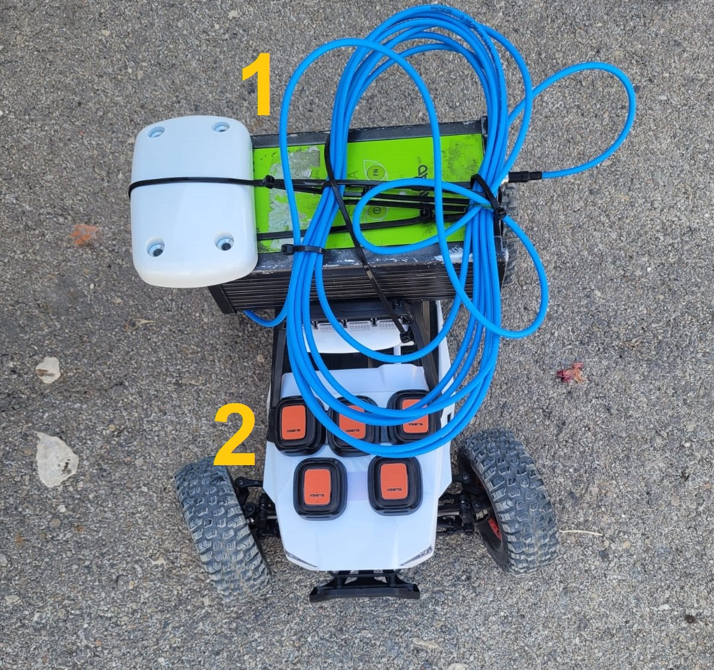
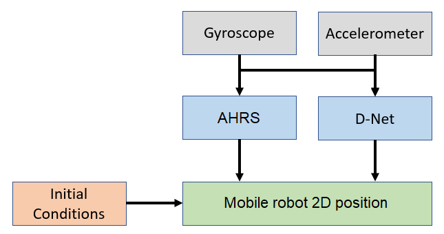
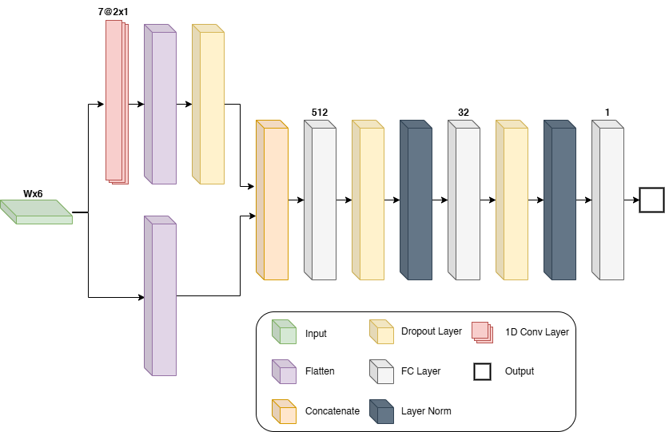

# Snake-Inspired Mobile Robot Positioning with Hybrid Learning

## Introduction

Mobile robots are used in various fields, from deliveries to search and
rescue applications. Different types of sensors are mounted on the robot to
provide accurate navigation and, thus, allow successful completion of its task.
In real-world scenarios, due to environmental constraints, the robot frequently
relies only on its inertial sensors. Therefore, due to noises and other error
terms associated with the inertial readings, the navigation solution drifts in
time. To mitigate the inertial solution drift, we propose the MoRPINet
framework consisting of a neural network to regress the robot's travelled
distance. To this end, we require the mobile robot to maneuver in a snake-like
slithering motion to encourage nonlinear behavior. MoRPINet was evaluated using
a dataset of 290 minutes of inertial recordings during field experiments and
showed an improvement of 33% in the positioning error over other methods for pure inertial navigation.

## Dataset
<p align="center">

</p>
A remote control (RC) car was used to conduct the experiments. 
The car model, STORM Electric 4WD Climbing Car, has dimensions of 385x260x205[mm], 
with a wheelbase of 253[mm] and a tire diameter of 110[mm]. 
The RC car was equipped with a Javad SIGMA-3N RTK sensor, which provides positioning measurements with an accuracy of 10[cm] at a sample rate of 10[Hz], serving as the GT. 
Additionally, five IMUs were mounted on a rigid surface at the front of the RC car. 
We worked with the Movella DOT IMUs, capable of operating at a 120[Hz]. 
The DOT software allows synchronization between the IMUs.
Thirteen distinct trajectories were recorded during field experiments with a total of 58 minutes for a single IMU and  290 for the entire dataset. 
Each trajectory includes GT data obtained from the GNSS RTK, and inertial measurements recorded simultaneously by the five IMUs mounted on the RC car. Each recording session began with a one-minute static period, which was utilized for stationary calibration and synchronize the timing between the IMU and GNSS RTK measurements. Synchronization between the two sensors was achieved during post-processing. 
The biases of the IMU's accelerometers and gyroscopes were determined by averaging the IMU measurements for a few seconds taken during the stationary period of each recording.

The test dataset includes four trajectories of driving between two fixed points with a distance of about 25 meters.  Those trajectories were recorded while the robot was moving in a snake-like slithering motion. 
The test dataset is the same for all baseline methods (INS and MoRPI) and the proposed MoRPINet approach.  Additionally, two straight-line motion trajectories with a distance of about 25 meters were recorded. 
We used the two straight-line motion trajectories to evaluate only the INS method as the common baseline setup. 

## Algorithm

<p align="center">

</p>

MoRPINet framework has three phases:
1. **Distance Estimation:** A shallow, yet efficient, network to estimate the distance over the required time window.
2. **Heading determination:** Madgwick filter is employed for heading estimation in the required window size.
3. **Position Update:** A dead-reckoning position update is applied based on the distance and heading from previous phases.

D-Net structure is presented in the figure below.

<p align="center">

</p>

 ## Citation
 
 If you found the experimental DATA useful or used our algorithm for your research, please cite our paper:
 ```
 @misc{etzion2024snakeinspiredmobilerobotpositioning,
      title={Snake-Inspired Mobile Robot Positioning with Hybrid Learning}, 
      author={Aviad Etzion, Nadav Cohen, Orzion Levy, Zeev Yampolsky, and Itzik Klein},
      year={2024},
      eprint={2411.17430},
      archivePrefix={arXiv},
      url={https://arxiv.org/abs/2411.17430}, 
}
 ```
 
 [](http://arxiv.org/abs/2411.17430)
 
<p align="center">

</p>
